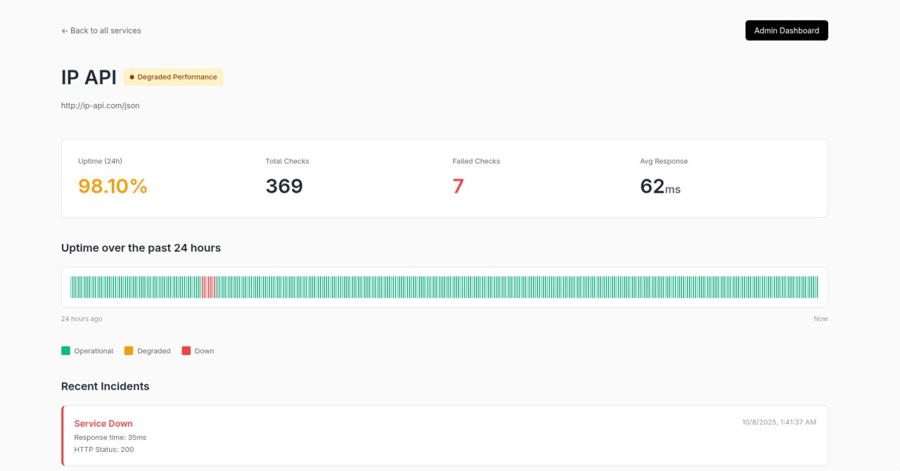

# Service Status – Uptime & Health Monitoring

A modern, high-performance service and API uptime monitoring solution  
powered by **Cloudflare Workers, Elysia (Bun runtime), Drizzle ORM, and D1 SQLite**.

Includes a public status page, live monitoring, per-service health views, admin dashboard, and incident notifications via Telegram and Slack.

---

---

## ✨ Features

- **Public Service Status Page** — View real-time uptime and health for all monitored endpoints.
- **Detailed Per-Service Monitoring** — See response times, last 24h timeline, and incident history.
- **Admin Dashboard** — Add/edit/remove services, manage integrations.
- **Customizable Alerts** — Notifications to Telegram and Slack.
- **Secure Auth** — Admin login via secure cookies.
- **Cloudflare D1** — Production-grade database for health checks & configs.
- **Automatic Health Checks** — Cloudflare cron support for scheduled checks.
- **Optimized for ElysiaJS** — Ultra-fast JSX SSR via Bun.

---

## 🚀 Quick Start

1. **Install Requirements**
    - [Bun](https://bun.sh/)
    - [Wrangler](https://developers.cloudflare.com/workers/wrangler/)

2. **Setup Project**
    ```
    bun install
    wrangler d1 create uptime-monitor
    # Copy your database_id to wrangler.toml
    bun run db:init    # Initialize tables
    bun run dev        # Start the dev server
    ```

    Open [http://localhost:8787/](http://localhost:8787/).

---

## 💻 Usage

- **Status Page**: `/`  
    _Public view of endpoints, status and timeline_
- **Per-Service Monitoring**: `/monitoring/[serviceId]`  
    _Historical health, stats, and incidents_
- **Admin Login**: `/admin/login`
- **Admin Dashboard**: `/admin`  
    _Add/edit/remove services, manage notifications_

**Default Admin Credentials**  
- Username: `admin`  
- Password: `admin123`  
(Edit `.dev.vars` or ENV variables for development)

---

## 🔔 Notifications

Web UI lets you add Slack/Telegram - alerts for downtime and unexpected status.

---

## ⚡️ Advanced

- **Configure:**  
  `.dev.vars` for BASE_URL, ADMIN_USERNAME, ADMIN_PASSWORD
- **Service CRUD:** Use admin dashboard
- **Test health checks:** call `/__health-check` (dev/local only)
- **Schema:** see `init.sql`
- **Scheduled checks:** Via `wrangler.toml` cron triggers

---

## 🙏 Credits

- Cloudflare D1
- ElysiaJS
- Drizzle ORM
- DaisyUI / TailwindCSS
